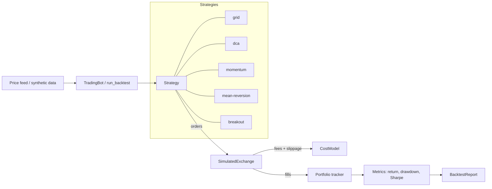

<p align="center">
  
</p>

<h1 align="center">Crypto Trading Bot</h1>

<p align="center">
  <strong>A multi-exchange crypto trading bot in Python — five strategies, a realistic cost model, a portfolio tracker, and a real backtest engine.</strong><br>
  Plug in an exchange, pick a strategy, backtest on the simulated exchange with fees and slippage, then go live.
</p>

<p align="center">
  <em>Built and maintained by <a href="https://viprasol.com">Viprasol Tech</a> — Fintech Experts. Full-Stack Builders.</em>
</p>

<p align="center">
  <a href="https://github.com/Viprasol-Tech/crypto-trading-bot/actions/workflows/ci.yml"></a>
  <a href="LICENSE"></a>
  
  
  
  
  <a href="https://t.me/viprasol_help"></a>
  <a href="https://github.com/Viprasol-Tech/crypto-trading-bot/stargazers"></a>
</p>

---

> ## Disclaimer
> This software is for **educational purposes only** and is **not financial advice**. Cryptocurrency trading is highly volatile and involves substantial risk, including the **total loss of capital**. Backtest results — even with fees and slippage modelled — are **not** indicative of future performance. Always test on the simulated exchange first, never trade money you cannot afford to lose, and comply with each exchange's terms and your local laws. **Use at your own risk** — Viprasol Tech assumes no responsibility for your trading results.

---

## Features

- **Five built-in strategies** — grid, DCA, momentum (EMA crossover), mean-reversion (RSI), and breakout (Donchian channel).
- **Streaming indicators** — `SMA`, `EMA`, `RSI`, and `RollingExtrema`, fed one price at a time, exactly like a live feed.
- **Realistic cost model** — proportional taker fees **plus** basis-point slippage applied to every fill, so backtests stay honest.
- **Portfolio tracker** — average-cost positions, realized / unrealized PnL, fee totals, equity, and serialisable snapshots.
- **Backtest engine + report** — return vs buy-and-hold (alpha), max drawdown, annualised Sharpe, CAGR, win rate, and the full equity curve.
- **Simulated exchange** — paper-trade with no API keys; rejects unaffordable orders (`InsufficientFunds`) just like a real venue.
- **Pluggable architecture** — strategies are pure `price in -> orders out`; the `Exchange` interface lets you bring Binance, Coinbase, Kraken, etc.
- **Typed config** — `pydantic` `BotConfig` validates symbol, cash, costs, and strategy params; a registry drives the CLI.
- **Rich CLI** — `version`, `strategies`, `demo`, `backtest` (with `--json`), and `compare` (ranks every strategy on the same series).
- **Modern tooling** — ruff, mypy (strict), 57 pytest tests, GitHub Actions CI.

## Quickstart

```bash
git clone https://github.com/Viprasol-Tech/crypto-trading-bot.git
cd crypto-trading-bot
python -m pip install -e ".[dev]"

# List the built-in strategies and their defaults:
crypto-trading-bot strategies

# Backtest momentum on a trending series with fees + slippage:
crypto-trading-bot backtest --strategy momentum --series trend --slippage-bps 5

# Rank every strategy on the same data:
crypto-trading-bot compare --series trend --bars 300
```

Example `compare` output:

```text
            Strategy comparison - trend (300 bars)
+-----------------------------------------------------------------+
| Rank | Strategy       |  Return |    Alpha |  MaxDD | Sharpe | Trades |
|------+----------------+---------+----------+--------+--------+--------|
|    1 | dca            | +29.78% |  -79.17% | +1.57% |   7.87 |     60 |
|    2 | breakout       |  +1.05% | -107.90% | +0.03% |   8.37 |      3 |
|    3 | momentum       |  +0.72% | -108.22% | +0.03% |   6.83 |      1 |
+-----------------------------------------------------------------+
Buy & hold baseline: +108.94%
```

## Usage (Python API)

```python
from crypto_trading_bot import CostModel, build_strategy, run_backtest
from crypto_trading_bot.data import trending

prices = trending(n=300, seed=7)                       # deterministic synthetic series
costs = CostModel(fee_rate=0.001, slippage_bps=5.0)    # 0.1% fee + 0.05% slippage

report = run_backtest(build_strategy("momentum"), prices, cash=10_000, cost_model=costs)

print(f"return   {report.total_return:.2%}")
print(f"alpha    {report.alpha:.2%} vs buy-and-hold")
print(f"drawdown {report.max_drawdown:.2%}")
print(f"sharpe   {report.sharpe:.2f}")
print(report.as_dict())   # flat dict, ready for JSON/CSV export
```

### Write your own strategy

```python
from crypto_trading_bot.strategies.base import Strategy
from crypto_trading_bot.models import Order, Side

class BuyTheDip(Strategy):
    name = "buy_the_dip"

    def on_price(self, symbol, price, exchange):
        if price < 90:
            return [Order(symbol, Side.BUY, 1.0, price)]
        return []
```

A runnable end-to-end example lives in [`examples/backtest_compare.py`](examples/backtest_compare.py).

## Architecture



## Modules at a glance

| Module | What it gives you |
| --- | --- |
| `strategies/` | `GridStrategy`, `DCAStrategy`, `MomentumStrategy`, `MeanReversionStrategy`, `BreakoutStrategy` |
| `indicators.py` | `SMA`, `EMA`, `RSI`, `RollingExtrema` (streaming) |
| `fees.py` | `CostModel` — proportional fees + basis-point slippage |
| `exchanges/` | `Exchange` interface + `SimulatedExchange` (paper trading) |
| `portfolio.py` | `Portfolio`, `Position`, `PortfolioSnapshot` (avg-cost PnL) |
| `metrics.py` | `total_return`, `max_drawdown`, `sharpe_ratio`, `cagr`, ... |
| `backtest.py` | `run_backtest()` -> `BacktestReport` (alpha, drawdown, Sharpe, win rate) |
| `config.py` | `BotConfig` (pydantic) + strategy registry |
| `data.py` | deterministic `sine` / `trend` / `random` price series |
| `cli.py` | `version`, `strategies`, `demo`, `backtest`, `compare` |

## Roadmap

- [x] Simulated exchange + grid & DCA strategies
- [x] Pluggable strategy interface + backtest runner
- [x] Momentum, mean-reversion & breakout strategies
- [x] Fees + slippage cost model
- [x] Portfolio tracker (PnL, fees, equity)
- [x] Backtest engine with metrics report (Sharpe, drawdown, alpha)
- [x] CLI subcommands (`backtest`, `compare`) + pydantic config
- [ ] Live exchange adapters (ccxt: Binance, Coinbase, Kraken)
- [ ] Multi-asset portfolio backtests
- [ ] Telegram alerts and a live paper-trading loop

## FAQ

**Does this place real trades?** No. Out of the box everything runs on the
in-memory `SimulatedExchange`. Implement the `Exchange` interface to connect a
real venue — and read the disclaimer first.

**Where does the price data come from?** The bundled generators in `data.py`
produce deterministic, seeded synthetic series for reproducible demos and tests.
Feed your own historical prices to `run_backtest()` for real research.

**Are fees and slippage included?** Yes. Every fill goes through `CostModel`,
which charges a proportional fee and moves the fill price against you by a
configurable number of basis points.

**Which strategy is best?** None universally — that is the point of `compare`.
Trend-followers (momentum, breakout) shine in trending markets; grid and
mean-reversion prefer ranging markets. Always backtest on your own data.

## Contributing

PRs welcome — see [CONTRIBUTING.md](CONTRIBUTING.md) and our [Code of Conduct](CODE_OF_CONDUCT.md).
Run the full gate locally before opening a PR:

```bash
ruff check . && ruff format --check . && mypy src && PYTHONPATH=src python -m pytest -q
```

## Contact — Viprasol Tech Private Limited

- Website: [viprasol.com](https://viprasol.com)
- Email: [support@viprasol.com](mailto:support@viprasol.com)
- Telegram: [t.me/viprasol_help](https://t.me/viprasol_help) | WhatsApp: +91 96336 52112
- GitHub: [@Viprasol-Tech](https://github.com/Viprasol-Tech) | [LinkedIn](https://www.linkedin.com/in/viprasol/) | X [@viprasol](https://twitter.com/viprasol)

## License

[MIT](LICENSE) (c) 2025 Viprasol Tech Private Limited
